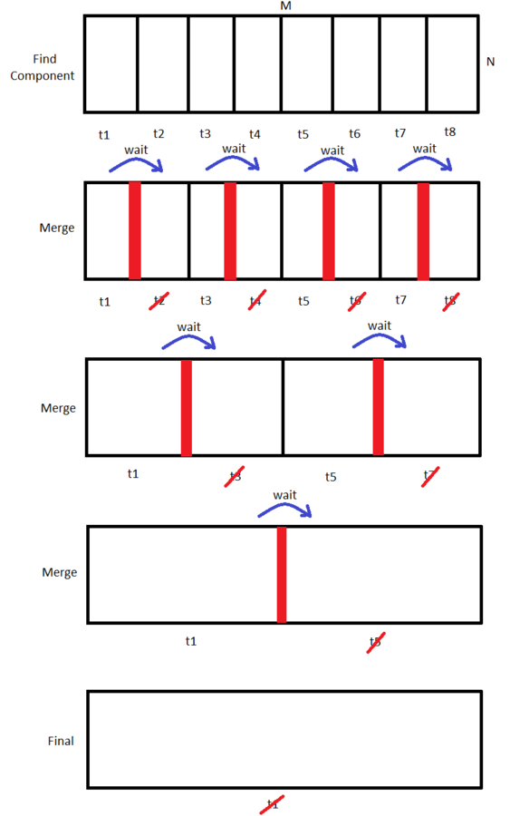
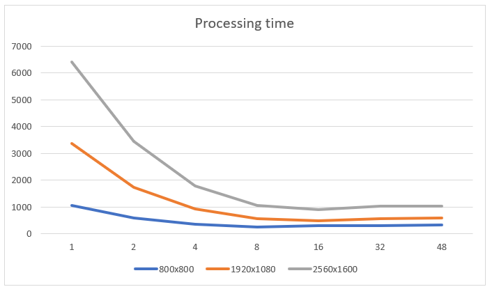
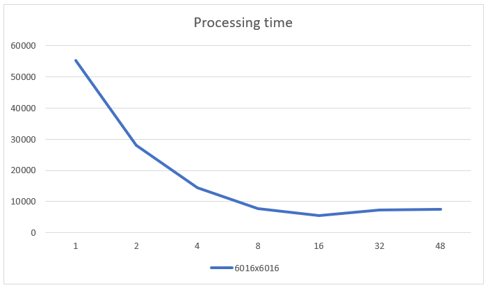
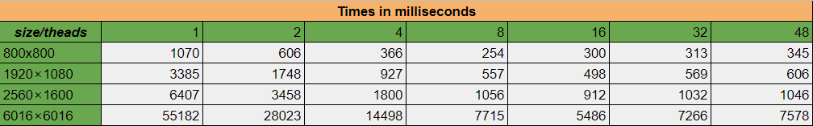
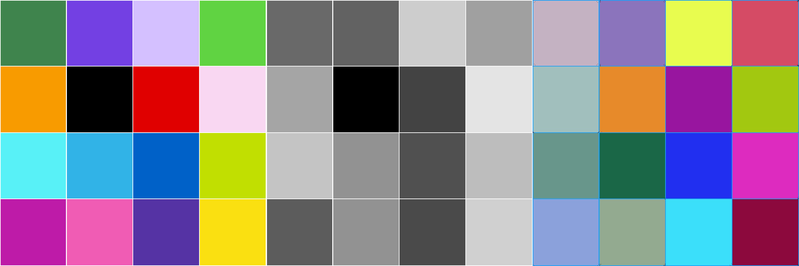
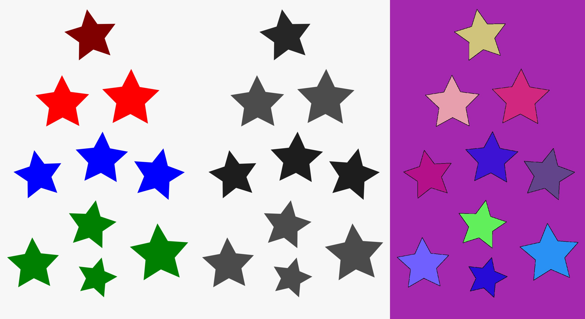
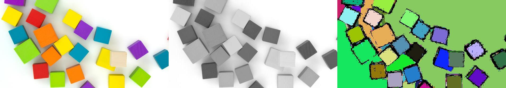
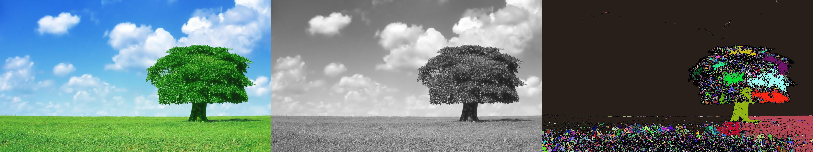
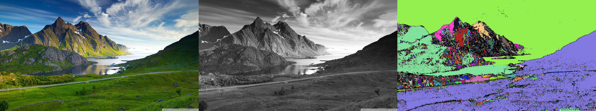
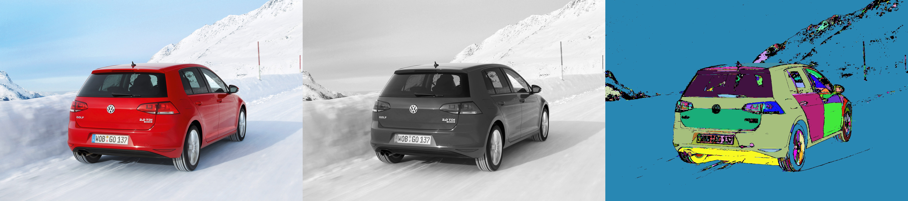

# Image connected components - concurrent algorithm
##### Java implementation made by Zdravko Hvarlingov

## Content
1. What are connected components? Why are they useful in image processing?
2. Task definition and mathematical model
3. Solution key ideas
4. Java implementation and usage
5. Test results and speedup
6. Result examples
7. Conclusion
8. Further improvements

## Connected components and their usefulness
In terms of graph theory finding the connected components is a relatively old task for both directed and undirected graphs.
Later that same problem is found in the field of image processing.
If we have to define it intuitively, we could say that a connected component of pixels is an image area where all the pixels have a similar color.
 
Usually finding the components of an image is a pre-processing step. The result is afterwards used as an input for further processing.
A quite simple application could be counting the number of elements inside the image (the number of coins for example :moneybag:)

## Task definition and mathematical model
Let's first define the task we are trying to solve. As stated above we are trying to find the image areas with similar color value.
This can be described in another way as we are trying to find the connected component for every single pixel.
Every pixel should have one even if it is the only one inside, right :sunglasses:?

The task can be easily transformed into a graph theory problem. Let's say we have a graph _**G <V, E>**_.
_**V**_ is the set of nodes and in our case every pixel will be a node inside the graph.
_**E**_ is the set of edges, **_<pixel1, pixel>_** is an edge only if **_pixel1_** and **_pixel2_** have similar colors and they are adjacent pixels.
If we imagine the image as a rectangular matrix of pixels, by adjacent we mean that both pixels share common side or edge. So using this definition every pixel has 8 adjacent pixels.

Using the above mathematical model the final task is to find the number of connected components inside that graph in a concurrent fashion :rocket:.

## Solution key ideas
### A single thread approach
Well, before we dive into the parallel and concurrent world it's good to see what standard single thread options and algorithms we have for connected components:
- **BFS** (Breadth-first search) - if we start a BFS from a single node(pixel) it is going to traverse only the connected component of this pixel.
Well, having this in mind, we can go through all pixels and if the pixel is not already traversed - start a BFS from that pixel. The number of BFS starts will give us the number of connected components.

- **DFS** (Depth-first search) - the idea is quite the same as the one described using the BFS algorithm. In pseudocode we can describe it as follows:
```
component = 0

for pixel in pixels:
    if pixel is not visited:
        # BFS or DFS will mark all the pixels inside the component as visited and will set their component to the 'component' variable
        BFS/DFS(pixel, component)
        component += 1
```

- **Union find (Disjoint set)** data structure - that data structure is quite famous and usually used inside the **Kruskal spanning tree algorithm**. 
It consists of two simple methods - union of sets and finding the leader(identification) of a set. The key thing is that it's worst time complexity is **O(1)** which makes it quite good at what it does :fire:.
All of this is more than perfect but how do we use it?
Well, in the beginning we can initialize every pixel to be a singleton set. Afterwards we go through all the pixels.
For every pixel we iterate through its adjacent pixels - if that adjacent pixel has similar color value, we unite the sets of the two pixels. That operation results in the union of their components.
In the end the Union data structure will contain **N** sets representing **N** connected components.
In addition to that we will have the exact component ID for every pixel. More than perfect!


### Concurrent or parallel approach
We already have multiple single threaded approaches. So it's time to analise them and see if they are appropriate and easily transformed for parallelism.

- **BFS/DFS** - unfortunately these can be made concurrent quite hard. The positive thing is that we can avoid making them concurrent.
The image itself is quite convenient for separation. So we can just spawn multiple BFSs(or DFSs) and afterwards have a merge phase. What about race conditions? Well since a single DFS will touch only its image region - no problem at all.
All we have to care is the synchronization of the threads during the merge phase.

- **Union find** - usually all we need for data structure itself is an array of size **N * M**, where **N** is the number of rows and M is the number of columns in the image.
So we can easily use the stated above approach where we separate the image into non crossing regions. All we have to ensure is that two or more threads are not writing to a single array index at the same time.
Well that simply could not be possible since we split the image into non crossing regions. Again the only thing that is a bit tricky is the synchronization during the merge phase.

As you probably noted in the text above, we are going to implement two phases of the algorithms:
1. Find the components of an image region
2. Merge all the components from the different regions

Well in order to avoid a wall of text, let's try to explain it all using the image:



As you can see once every first thread of the working ones finish it waits for the one right after it.
Afterwards it merges the components of both regions using the last column of the first thread.
At every step the number of threads is twice less. At the very end we draw all different components with unique random colors and we draw only the ones which have at least 10 pixels in them. Yes, the number 10 is a bit magical but can be easily changed.

### Color similarity
Color similarity is quite important part to be discussed because the result can be changed dramatically depending on how we determine it.
1. **Colorful images**(RGB, HSV, etc..) - unfortunately this approach could not achieve satisfying results since the vector distance between two colors(most of the times with 3 components) usually is not a good metric for color similarity.
2. **Grayscale images** - here for each pixel we have a single value(usually in the range 0-255). As you can image the similarity is calculated quite easily - we get the absolute difference between the values of two pixels. Even though this approach is not perfect, it works far more superior than the previous one.
That's why it is the one used inside this project for the example images.
3. **Binary images**(black and white for example) - in terms of components finding, this is the best approach since we get perfect separation between the pixels and we have two possible options - either they have the same color or not. The only problem is that usually we use a lot of information during the process of making an image binary.

At the end of the day it really depends what kind of problem we are solving - if we are processing landscape images probably the color or grayscale approaches are better. But if the image is quite more simple, maybe it is better to make it binary(coins counting for example).

## Java implementation and usage
### Python attempt
Since python is much better integrated with OpenCV and easy to use, the first implementation tried using it.
Unfortunately python does not support real multithreading and all the threads are running concurrently. Because of that no speed up was achieved no matter the CPU performance or the number of threads.

### Java attempt
Java is known to be much faster, nearly as fast as C and C++. Real multithreading is supported for sure. In addition OpenCV is also supported even though documentation is almost non present.
The other positive is that with the help of Java cross platform execution and jar packaging the application could be easily packaged and executed on any machine for testing purposes.

### Usage
The application is implemented as a self explanatory CLI tool. There are two options if you want to use and test it:
1. Clone the repository with your favorite editor or IDE, make sure you have at least Java 8 installed and start the application from the **Boot** file.
2. There is much easier way. Download the compiled jar from _https://drive.google.com/file/d/1p6CVfiscnOg8ZwGw6Fd5R0S1HRzvftYq/view?usp=sharing_. Afterwards just start the jar file.
3. Of course, the maven project is configured properly so you can easily make some modifications to the implementation and repackage it with the included **pom.xml**.


Here is the command for using the jar file:
```
java -jar executable.jar -i ../images/landscape.jpg -t 10 -s 7 --verbose
```

You can see that there are multiple CLI arguments:
- **--i or -image**: the path to the image you want to process
- **--t or -threads**: the number of threads used by the algorithm
- **--s or -similarity**: the grayscale similarity threshold, which is an integer value(ex. 5, 10, 15...)
- **--verbose**: specifies whether you want to see additional logs or not


## Test results and speedup
Here comes the interesting part. At the end of the day if there is no significant time boost there is no reason to use concurrency at all, isn't it?

The CLI tool was tested on the following hardware setup provided by **Google Cloud Compute**:
```
CPU: Intel® Xeon® Processor E5-2630, 15M Cache, 2.30 GHz, 24 virtual cores, 48 threads
RAM: 24GB DDR4 2400MHz
OS: Debian 10
```
Having 48 threads under the roof should be more than enough for testing purposes even if we can't use all of them in parallel at the same time.

I know you are curious, so here are the results displayed on these diagrams:





Here you can see the exact times:



As we can see there is a significant time boost with more than 10 times in the case of **6016x6016** image.
Unfortunately what we can notice is that after a certain point adding more threads does not improve the overall time since it comes with a price(spawning and destroying threads plus threads synchronization).
## Result examples
It has all been text and numbers until now but at the end of the day we are talking about image processing. So here are some example results:















As you can see - the more details inside the image, the harder it gets to guess the right similarity when using grayscale.
Also it can be easily seen that shadows are somewhat of an enemy of the algorithm.

## Conclusion
Well even though it seems like an easy task at first, making all of it concurrent is not as easy as it looks.
The good thing is that a significant speed-up was achieved following a relatively simple strategy.

## Further improvements

1. Research more deeply about color similarity and how to measure it within complex color images.
